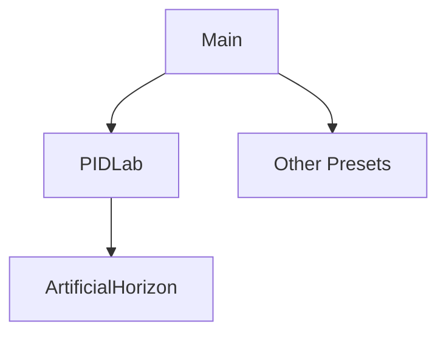

# Architecture

Flight Laboratory is constructed of a QML front end and a C++ back end. The front end handles the visual elements of the UI, while the back end handles the data that the UI displays.

## Front End

The front end does not handle any flight logic. It is solely responsible to display the data that is produced by the back end.

The front end consists of an application window that allows the user to choose a preset. Once chosen, this preset in loaded. 

Presets currently available are:
+ PIDLab 

## Back End

This controls all the flight logic.

Currently implemented is a basic dynamics simulator that simply generates a roll angle in the shape of a sin wave. This is then plugged into the front end:

