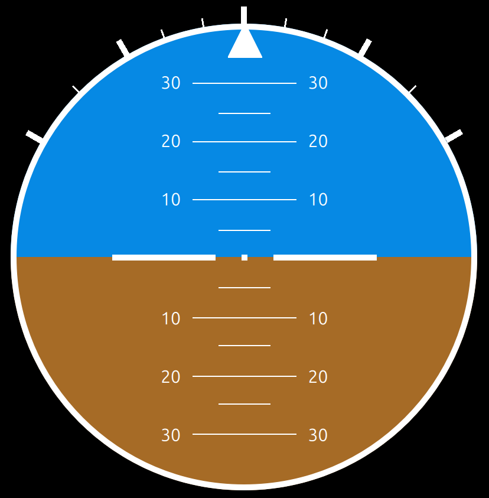

# Components

## UI

### Artificial Horizon

Implements an _artificial horizon_, an instrument for attitude indication. The top (blue) half represents the sky, the bottom (brown) half represents the ground, while the border indicates represents the horizon. 

Spanning vertically is the _pitch ladder_, where each line represents 5 degrees of vehicle pitch. This either indicates positive pitch (when the horizon crosses the lines along the bottom half), or negative pitch (for the top lines respectively). 

The triangle at the top of the circular dial is the _roll indicator_. This indicates the vehicle's roll angle with the help of the ticks on the outside of the dial's bezel. The first three ticks in each direction represent 10 degrees of roll. After that, each tick represents 15 degrees.

## Back End

### Basic Dynamics Sim

This class creates a sinusoidal output for the roll angle at 1Hz. For the API documentation, see .