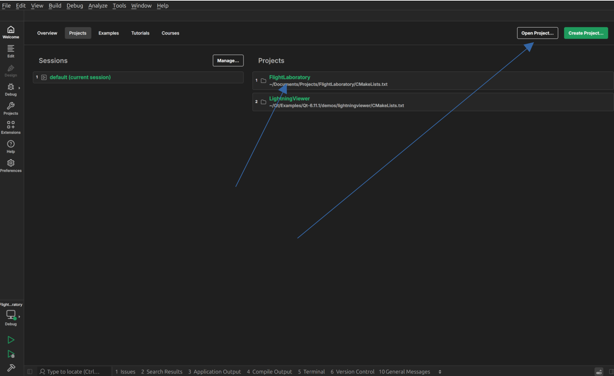
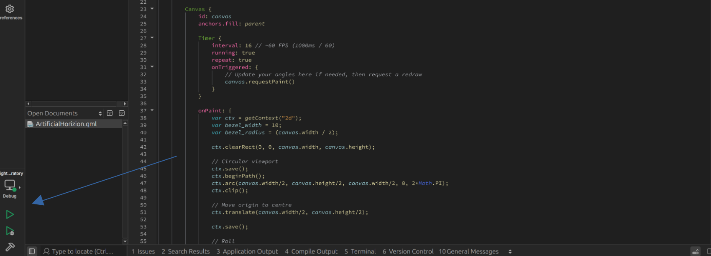

# Setup and Build Guide for Qt-Creator

To run Flight Laboratory, head to the repo and clone it.

In Qt-Creator, select "Open Project" and navigate to the cloned repo. If the project has been opened before, it will be visible on the welcome page and can be selected from there.



Once the project has been opened, it can be built and run with the buttons in the bottom left.



## Documentation

Documentation for this project is generated using [MkDocs](https://www.mkdocs.org/). A couple of installations are required to run this, including mkdoxy, which generates API documentations from docstrings in the code.

To get started, create a virtual environment at the root FlightLaboratory/ directory using:

```bash
python3 -m venv .venv
```

Then run

```bash
pip install -r requirements.txt
```

To create new documentation, create a new .md file under FlightLaboratory/Docs/docs/, and reference it under FlightLaboratory/Docs/mkdocs.yml, in the following section, and in the order it should appear with respect to the existing documentation:

```yml
nav: 
  - Home: index.md
  - Developer Guide: development.md
  - Architecture: architecture.md
  - Components: components.md
```

## Building and Running FlightLaboratory from VSCode

If you're like me and prefer working in VSCode, head over [here](dev-guide/setup-build-vscode.md) for the setup and build guide.