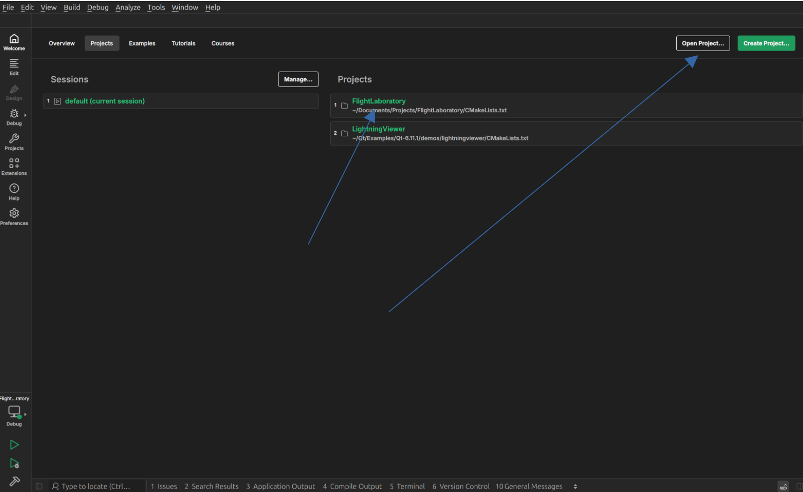
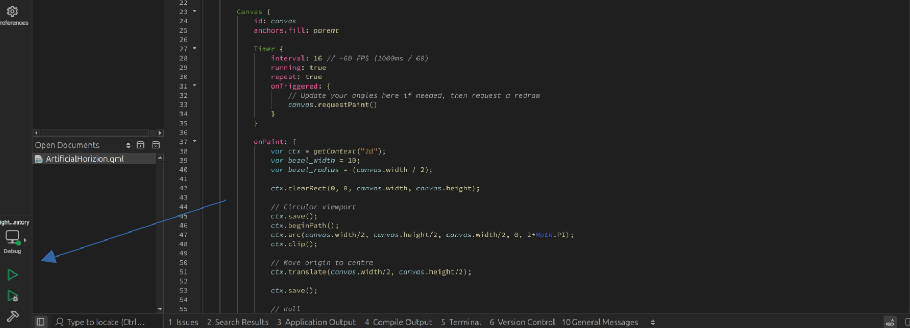

# Developer Guide

## OS

- Ubuntu xx.xx (or whatever Qt needs)

## Installing Qt

As the UI is based on Qt, the first thing to do is to install it. Head over [here](https://www.qt.io/development/download-qt-installer-oss), and download the according installer for your OS. The installation has only been tested on Ubuntu 24.04 so far.

Once downloaded, run the installer and follow the steps. Ensure you install Qt-Creator while at it. This is the Qt-Specific IDE which streamlines the development. Of yourse, you can also use VSCode, but the instructions here mainly cover Qt-Creator.

## Execution

To run Flight Laboratory, head to the repo and clone it.

In Qt-Creator, select "Open Project" and navigate to the cloned repo. If the project has been opened before, it will be visible on the welcome page and can be selected from there.



Once the project has been opened, it can be built and run with the buttons in the bottom left.



## Documentation

Documentation for this project is generated using [MkDocs](https://www.mkdocs.org/). A couple of installations are required to run this, including mkdoxy, which generates API documentations from docstrings in the code.

To get started, create a virtual environment at the root FlightLaboratory/ directory using:

```bash
python3 -m venv .venv
```

Then run

```bash
pip install -r requirements.txt
```

To create new documentation, create a new .md file under FlightLaboratory/Docs/docs/, and reference it under FlightLaboratory/Docs/mkdocs.yml, in the following section, and in the order it should appear with respect to the existing documentation:

```yml
nav: 
  - Home: index.md
  - Getting Started: getting-started.md
  - Developer Guide: development.md
  - Architecture: architecture.md
  - Components: components.md
```